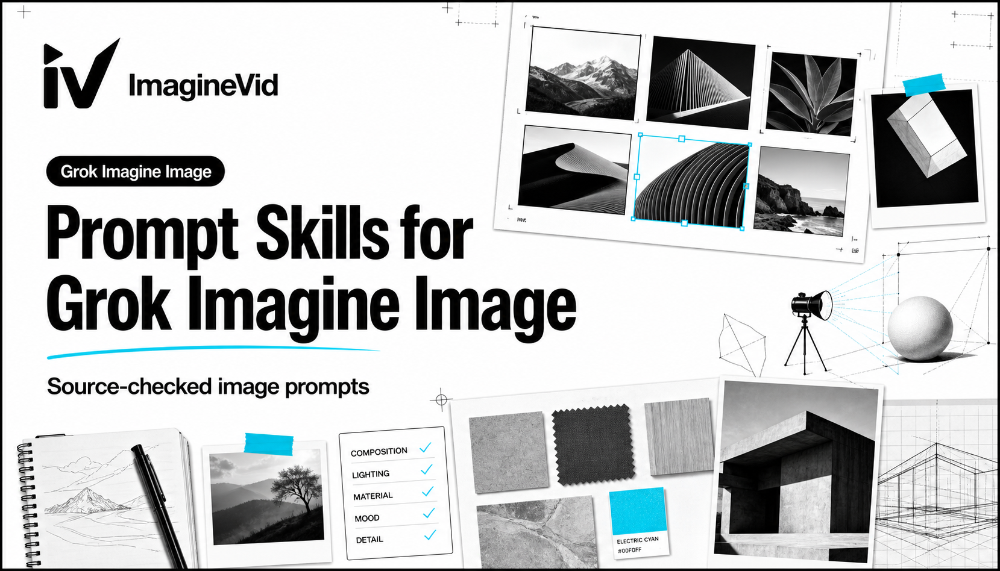

<a href="https://github.com/imagineVid/Awesome-grok-imagine-image-prompts-and-skills"></a>

# Awesome Grok Imagine Image Prompts & Skills

> 재사용 가능한 제작 노트, 원본 미디어, 정확한 출처를 갖춘 검증된 커뮤니티 프롬프트 모음입니다.

[](https://github.com/sindresorhus/awesome) [](LICENSE) [](https://github.com/imagineVid/Awesome-grok-imagine-image-prompts-and-skills)

[English](README.md) · [简体中文](README.zh.md) · [日本語](README.ja.md) · [**한국어**](README.ko.md) · [Español](README.es.md) · [Deutsch](README.de.md) · [Français](README.fr.md) · [Italiano](README.it.md) · [Português](README.pt.md) · [Türkçe](README.tr.md) · [العربية](README.ar.md) · [Русский](README.ru.md) · [Nederlands](README.nl.md) · [Polski](README.pl.md)

---

## 목차

- [모델 가이드](#model-guide)
- [워크플로 색인](#workflow-index)
- [검증된 커뮤니티 사례](#verified-community-cases)
- [기여하기](#contribute)
- [라이선스와 출처](#license-and-attribution)

<a id="model-guide"></a>

## 모델 가이드

Grok Imagine Image은 멀티모달 이미지 생성과 정밀 편집을 위한 모델입니다. 이 저장소는 확인되지 않은 홍보 문구 대신 전체 프롬프트, 결과, 원본 출처를 검증할 수 있는 실제 사례에서 재사용 가능한 제작 방식을 정리합니다.

### 이 컬렉션의 검증 항목

- Text-to-image composition with explicit framing and lighting
- Image transformation while preserving pose, identity, or background
- Product photography with controllable materials and camera language
- Stylized rendering that separates structure from surface treatment

**[Open Grok Imagine Image on ImagineVid](https://imaginevid.io/grok-image)**

<a id="workflow-index"></a>

## 워크플로 색인

- **Portrait & Character Design**
- **Product Photography**
- **Split-Style Transformations**
- **Fantasy & Worldbuilding**
- **Editorial Composition**

<a id="verified-community-cases"></a>

## 검증된 커뮤니티 사례

| 컬렉션 현황 | 13 개의 검증 사례 |
|---|---:|
| 마지막 생성 | 2026-07-19 |

### 1. Realistic-to-cartoon split portrait

A controlled split treatment that preserves pose and background while changing rendering language.

#### 프롬프트

```text
Split-style image with the subject divided vertically. LEFT: realistic photo with natural light, clear details, slight enhancement, and subtle doodle outlines. RIGHT: stylized cartoon version, same pose and expression, clean lineart, soft shading, vibrant or pastel colors, with small decorative doodles. Keep original background. Add a torn or glitch split. Modern, soft lighting, aesthetic, ultra-detailed.
```

<table><tr>
<td width="25%"></td>
<td width="25%"></td>
<td width="25%"></td>
<td width="25%"></td>
</tr></table>

#### 출처 근거

- **제작자:** [@Goodmanprotocol](https://x.com/Goodmanprotocol)
- **원본 게시물:** [X / Twitter](https://x.com/Goodmanprotocol/status/2040110800212500811)
- **게시일:** 2026-04-03
- **카테고리:** Portrait & Character Design

**[ImagineVid에서 이 프롬프트 사용](https://imaginevid.io/grok-image)**

---

### 2. Moonlit silver forest spirit

A detailed fantasy portrait balancing material texture, bioluminescence, and restrained color.

#### 프롬프트

```text
Hyper-detailed photorealistic cinematic side profile of a graceful forest spirit standing in a mystical glowing forest at night. She has long flowing dark hair with glowing silver and black flowers and delicate silver vines. Her skin has subtle bark-like texture with intricate glowing silver and black patterns across her face, neck, and shoulders. She wears a flowing ethereal dress made of layered translucent dark leaves and glowing silver vines. She stands with an elegant, mysterious expression, one hand gently extended with small glowing silver particles floating around it. Soft volumetric moonlight and bioluminescent plants create beautiful deep black and silver lighting with gentle god rays. Ultra-realistic textures on skin with glowing patterns, individual leaves, flower petals, glowing vines, hair, and fabric-like textures. Strong intricate details, magical cinematic lighting, and dark elegant atmosphere. Masterpiece, best quality, 8K resolution, cinematic composition, shallow depth of field
```

<table><tr>
<td width="100%"></td>
</tr></table>

#### 출처 근거

- **제작자:** [@Kisalay_](https://x.com/Kisalay_)
- **원본 게시물:** [X / Twitter](https://x.com/Kisalay_/status/2069306961917833499)
- **게시일:** 2026-06-23
- **카테고리:** Product Photography

**[ImagineVid에서 이 프롬프트 사용](https://imaginevid.io/grok-image)**

---

### 3. Fully directed cinematic character frame

A long-form image brief that demonstrates control over composition, lighting, wardrobe, and atmosphere.

#### 프롬프트

```text
Try this Grok Imagine image prompt. Notice how Imagine gives you complete control over every aspect of your generations.

long-click this image to generate a video in Grok Imagine.

>>>

A beautiful woman with a face resembling Motoko Kusanagi from Ghost in the Shell, featuring a short sleek full volume bob haircut falling just above the shoulders, straight bangs framing the face, subtle layering for a sharp professional look, asymmetrical split bob with the left side longer, hair in a colorful pastel gradient primarily white fading into streaks of yellow, red, and black; pale porcelain skin, piercing yellow eyes with black eyeliner, black spade symbol on right cheek, black teardrop mark under left eye, glossy yellow lips with a subtle smirk; wearing a shiny yellow cape draped over shoulders, black form-fitting sleeveless top with yellow trim, black choker with yellow accents, black arm gloves.

The style is an anime-inspired digital painting with hyper-realistic rendering, smooth gradients, and sharp details, embodying a cyberpunk fantasy vibe.

The environment is a solid golden-yellow gradient background with no additional elements.

Lighting features dramatic side lighting from the left, creating soft highlights on the face and hair, deep shadows on the right side for high contrast, and a subtle rim light outlining the figure.

The composition is a close-up portrait from the shoulders up, with the subject turned slightly to the right looking over the shoulder at the viewer, centered with balanced negative space.

The color palette includes vibrant golden yellow as the dominant color, deep navy black, crimson red accents, pale white skin tones, and cool monochrome shadows.

The camera uses a vertical portrait orientation, medium shot, with a shallow depth of field focusing on the face and crisp foreground details. The mood is enigmatic, seductive, playful yet intense.

Details include a glossy sheen on hair and clothing, reflective highlights in the eyes, smooth porcelain texture on the skin, subtle airbrush blending, and faint chromatic aberration edges.

The output quality is ultra-high resolution, 8k, with sharp focus, a clean render, subtle grain, and bloom effects.
```

<table><tr>
<td width="100%"></td>
</tr></table>

#### 출처 근거

- **제작자:** [@tetsuoai](https://x.com/tetsuoai)
- **원본 게시물:** [X / Twitter](https://x.com/tetsuoai/status/1990288045531340840)
- **게시일:** 2025-11-17
- **카테고리:** Split-Style Transformations

**[ImagineVid에서 이 프롬프트 사용](https://imaginevid.io/grok-image)**

---

### 4. White-haired figure on a gothic throne

A concise character prompt with a strong throne silhouette and gothic environment.

#### 프롬프트

```text
A young woman with white hair sits on a gothic throne in outer space, surrounded by a nebula, in a surreal sci-fi style.
```

<table><tr>
<td width="100%"></td>
</tr></table>

#### 출처 근거

- **제작자:** [@tetsuoai](https://x.com/tetsuoai)
- **원본 게시물:** [X / Twitter](https://x.com/tetsuoai/status/1990144761416872008)
- **게시일:** 2025-11-16
- **카테고리:** Fantasy & Worldbuilding

**[ImagineVid에서 이 프롬프트 사용](https://imaginevid.io/grok-image)**

---

### 5. Low-angle black perfume campaign

A product-photography brief using low camera placement, ribbed glass, dark materials, and premium lighting.

#### 프롬프트

```text
Low angle luxury product photography of a black ribbed glass perfume bottle placed on a dark horizontal podium, shot from below for a heroic, monumental feel. The bottle is Tom Ford Black Orchid, matte black texture clearly visible.
Dramatic low key studio lighting. Soft diffused key light from above and slightly left, gently lighting the label and top, revealing volume and texture. Strong hard red rim light from behind and right, creating a bold red outline along the edge and cap, with a subtle red glow bleeding into the background.
Deep soft shadows with smooth falloff. Slightly underexposed for drama. High contrast between highlights and shadows while keeping transitions soft.
Color palette limited to deep black and rich burgundy red, warm color balance, black remains neutral and clean.
Matte surface shows soft red reflections, not glossy, giving depth and form.
Minimal background, dark red gradient, cinematic mood, luxury fragrance advertising style, photorealistic, ultra high detail, studio quality.
```

<table><tr>
<td width="50%"></td>
<td width="50%"></td>
</tr></table>

#### 출처 근거

- **제작자:** [@harboriis](https://x.com/harboriis)
- **원본 게시물:** [X / Twitter](https://x.com/harboriis/status/2018312144358703594)
- **게시일:** 2026-02-02
- **카테고리:** Editorial Composition

**[ImagineVid에서 이 프롬프트 사용](https://imaginevid.io/grok-image)**

---

<!-- expansion-2026-07-18 -->

## 추가 검증 커뮤니티 사례

### 6. Moonlit forest spirit in pink and silver

A tightly controlled fantasy portrait combining luminous materials, floral detail, moonlight, and a restrained black-silver-pink palette.

#### 프롬프트

```text
Hyper-detailed photorealistic cinematic three-quarter front view of a graceful forest spirit standing in a mystical moonlit forest. She has long flowing silver-white hair with glowing soft pink and silver flowers and delicate vines. Her skin has subtle bark-like texture with intricate glowing silver and soft pink patterns across her face, neck, and shoulders. She wears a flowing ethereal dress made of layered translucent leaves and glowing silver-pink vines. She stands gracefully with one hand gently extended, small glowing silver-pink particles floating around her palm. Soft volumetric moonlight filters through the trees from above, creating beautiful cool silver and pink lighting with gentle god rays. Ultra-realistic textures on skin with glowing patterns, individual leaves, flower petals, glowing vines, hair, and fabric-like textures. Strong intricate details, magical cinematic lighting, and serene dreamy atmosphere. Masterpiece, best quality, 8K resolution, cinematic composition, shallow depth of field.
```

<table><tr>
<td width="100%"></td>
</tr></table>

#### 출처 근거

- **제작자:** [@Kisalay_](https://x.com/Kisalay_)
- **원본 게시물:** [X / Twitter](https://x.com/Kisalay_/status/2068899277598830923)
- **게시일:** 2026-06-22
- **카테고리:** Fantasy & Worldbuilding

**[ImagineVid에서 이 프롬프트 사용](https://imaginevid.io/grok-image)**

---

### 7. Selfie clarity enhancement without content changes

A preservation-sensitive edit that improves exposure, texture, and detail while explicitly protecting the source identity and composition.

#### 프롬프트

```text
"Photorealistic selfie style image of a stunning 20-year-old woman using the facial identity and facial geometry from [uploaded image]. She has long vibrant cherry-red hair, blunt straight bangs across her forehead, and a thick long braid on her right side secured near the bottom with a black hair tie, loose strands at the end. She has large expressive hazel-brown eyes with sharp black winged eyeliner and long lashes, perfectly shaped thick eyebrows, full glossy red lips, and a confident expression with direct eye contact and head tilt. She is wearing a fitted white long-sleeve button-up collared oxford shirt with visible buttons and natural fabric wrinkles, a loose black satin necktie hanging down the center, and black bottoms. Multiple silver ear piercings and earrings on both ears, including hoops and a dangling intricate earring on her left ear. She is taking a casual selfie with her right arm extended upward out of frame holding the camera, body leaning slightly forward, crouching on a red couch. The room has intense cinematic red ambient lighting casting a strong red glow and deep shadows across her skin, hair, and clothes. Background wall is covered with multiple framed and pinned anime-style posters and prints of varying sizes, including a prominent one showing two hands forming a heart shape with a small black heart in the center. Dark shelves with books and collectibles visible on the left side, along with a white stylized helmet or mask object. Red upholstered furniture in the foreground. Highly detailed skin texture, individual hair strands, realistic fabric details, sharp focus, natural smartphone selfie lighting mixed with dramatic red cinematic color grade, photorealistic, 8k resolution, vertical portrait composition."
```

<table><tr>
<td width="100%"></td>
</tr></table>

#### 출처 근거

- **제작자:** [@asheem01](https://x.com/asheem01)
- **원본 게시물:** [X / Twitter](https://x.com/asheem01/status/2064686648051270055)
- **게시일:** 2026-06-10
- **카테고리:** Portrait & Character Design

**[ImagineVid에서 이 프롬프트 사용](https://imaginevid.io/grok-image)**

---

### 8. Extend a weekly Bitcoin chart by one year

A concise information-editing test that asks the model to continue a chart while preserving its visual language and temporal scale.

#### 프롬프트

```text
This is a weekly chart of $BTC. Can you please add another 1 year (52 weeks) to the chart?
```

<table><tr>
<td width="100%"></td>
</tr></table>

#### 출처 근거

- **제작자:** [@Arlo_the_Intern](https://x.com/Arlo_the_Intern)
- **원본 게시물:** [X / Twitter](https://x.com/Arlo_the_Intern/status/2062651827154538962)
- **게시일:** 2026-06-04
- **카테고리:** Editorial Composition

**[ImagineVid에서 이 프롬프트 사용](https://imaginevid.io/grok-image)**

---

### 9. Restore color and exposure in a 1998 slide scan

A practical archival-photo edit that improves color balance, exposure, and dynamic range without rewriting the photographed content.

#### 프롬프트

```text
Enhance the color balance and exposure, and add HDR where needed. Do not alter the actual content of the image.
```

<table><tr>
<td width="50%"></td>
<td width="50%"></td>
</tr></table>

#### 출처 근거

- **제작자:** [@stevecrye](https://x.com/stevecrye)
- **원본 게시물:** [X / Twitter](https://x.com/stevecrye/status/2050019565778722921)
- **게시일:** 2026-05-01
- **카테고리:** Split-Style Transformations

**[ImagineVid에서 이 프롬프트 사용](https://imaginevid.io/grok-image)**

---

### 10. Watercolor baker in a pastoral fantasy kitchen

A complete text-to-image prompt balancing character, action, setting, palette, paper texture, and camera framing.

#### 프롬프트

```text
Beautiful young baker with honey-brown skin and rosy cheeks, dark curly hair tucked under a flour-dusted linen scarf, wearing a simple sleeveless tunic in warm saffron yellow. She laughs as she kneads dough on a wooden table, forearms dusted white. Through an arched window behind her, morning sunlight pours in.
Fantasy setting: cozy kitchen in a countryside village of round hobbit-like doors. Lavender fields and rolling green hills outside. A fluffy orange cat with a tiny flour smudge on its nose sits on the windowsill, watching her with big round eyes.
Mood: warm, joyful, simple domestic bliss. Soft watercolor washes, visible brushstrokes, paper texture, gentle bleeding at edges. Palette of saffron yellow, lavender, cream white, sage green, and berry red. Cinematic medium shot from slight low angle. Masterpiece quality.
```

<table><tr>
<td width="100%"></td>
</tr></table>

#### 출처 근거

- **제작자:** [@DavidLi36143625](https://x.com/DavidLi36143625)
- **원본 게시물:** [X / Twitter](https://x.com/DavidLi36143625/status/2052139222572949974)
- **게시일:** 2026-05-06
- **카테고리:** Editorial Composition

**[ImagineVid에서 이 프롬프트 사용](https://imaginevid.io/grok-image)**

---

### 11. Single mekugi correction on a katana handle

A surgical two-reference product edit that preserves the diagonal shirasaya composition while changing only one construction detail on the handle.

#### 프롬프트

```text
Keep the first image's diagonal katana shirasaya composition, white background, and plain wooden saya with no pegs. On the tsuka handle only, show a single mekugi like the second image: one dark circular pin embedded flush into the wood near the habaki. Preserve the blade angle, lighting, grain direction, proportions, and all other details exactly. Do not add a second peg or alter the saya.
```

<table><tr>
<td width="100%"></td>
</tr></table>

#### 출처 근거

- **제작자:** [@sakana_no_sippo](https://x.com/sakana_no_sippo)
- **원본 게시물:** [X / Twitter](https://x.com/sakana_no_sippo/status/2078211037103616314)
- **게시일:** 2026-07-17
- **카테고리:** Product Photography

**[ImagineVid에서 이 프롬프트 사용](https://imaginevid.io/grok-image)**

---

### 12. Atmospheric navy-lace apartment portrait

A compact photoreal portrait brief centered on pose, wardrobe texture, jewelry, skin lighting, and a softly separated interior background.

#### 프롬프트

```text
Photorealistic high-resolution photograph of an adult Scandinavian fashion model with long blonde hair and an athletic build in a living-room apartment, looking over her shoulder in a dark navy-blue sleeveless lace gown. Add layered silver necklaces and sparkling crystal drop earrings. Use soft atmospheric lighting that shapes natural skin texture and separates the subject from a dreamy, shallow-depth-of-field interior background. Refined editorial styling, realistic anatomy, restrained color grade.
```

<table><tr>
<td width="50%"></td>
<td width="50%"></td>
</tr></table>

#### 출처 근거

- **제작자:** [@tealdog2](https://x.com/tealdog2)
- **원본 게시물:** [X / Twitter](https://x.com/tealdog2/status/2076881249457799506)
- **게시일:** 2026-07-14
- **카테고리:** Portrait & Character Design

**[ImagineVid에서 이 프롬프트 사용](https://imaginevid.io/grok-image)**

---


### 20. 따뜻한 에디토리얼 조명의 텔리체리 페퍼 매시드 포테이토

재료의 출처, 질감, 그릇 구도와 따뜻한 에디토리얼 조명을 제어하는 출처 기반 Grok Imagine Image 음식 사례입니다.

#### Prompt

```text
Create a photorealistic food-editorial image of rustic mashed potatoes served in a shallow handmade ceramic bowl. The potatoes should look creamy but textured, with visible ridges from a spoon, a small pat of butter melting into the center, and a deliberate scatter of freshly cracked Tellicherry peppercorns. Suggest the ingredient story through subtle supporting details: a linen napkin, a wooden pepper mill, and a few natural potato skins on a warm stone counter. Use soft golden side light, realistic steam, controlled highlights on the butter, shallow depth of field, and a calm premium cookbook composition. Keep the bowl centered with generous breathing room. No brand logos, fake labels, plastic-looking food, extra utensils, or decorative clutter.
```

<div align="center"></div>

#### Source evidence

- **Creator:** [@AliciaMcnatt](https://x.com/AliciaMcnatt)
- **Canonical post:** [X / Twitter](https://x.com/AliciaMcnatt/status/2084242503889277038)
- **Published:** 2026-08-03
- **Category:** Product Photography

**[Use this prompt on ImagineVid](https://imaginevid.io/grok-image)**

---

<a id="contribute"></a>

## 기여하기

모델명이 명시되고 완전한 프롬프트, 원작자 표시, 확인 가능한 결과 미디어가 있는 사례만 제출하세요.

[Submit a verified prompt](https://github.com/imagineVid/Awesome-grok-imagine-image-prompts-and-skills/issues/new?template=submit-prompt.yml)

<a id="license-and-attribution"></a>

## 라이선스와 출처

ImagineVid가 작성한 코드와 편집 문구는 CC BY 4.0입니다. 제3자 프롬프트와 미디어의 권리는 각 제작자에게 있습니다.

The collection was curated by **Mira Voss** for ImagineVid.
